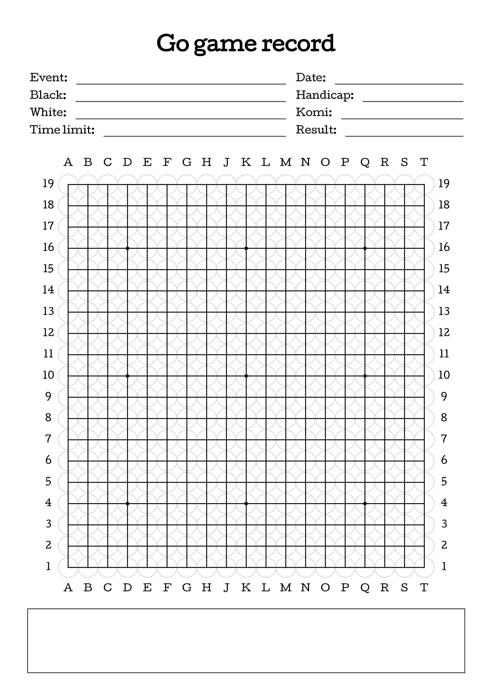

# Go game record form

[](https://opensource.org/licenses/MIT)

This is a simple form for recording go games.

## [👉 Download PDF 👈](https://github.com/busser/go-game-record-form/raw/main/go-game-record-form.pdf)



## Generating the PDF and PNG

You'll need Google Chrome and ImageMagick installed. Then run:

```
make
```

## License

This project is licensed under the MIT License - see the [LICENSE](LICENSE) file
for details.
